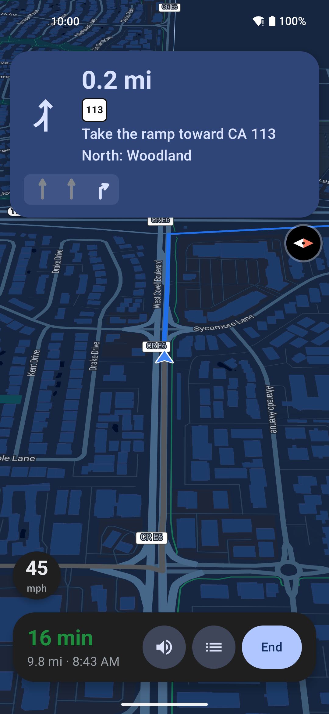
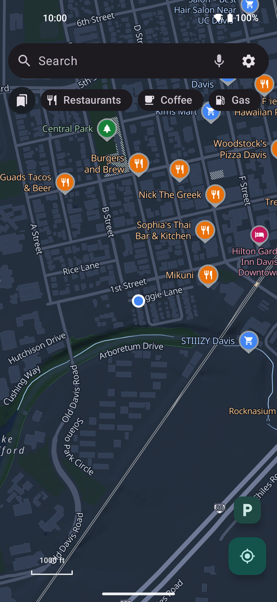
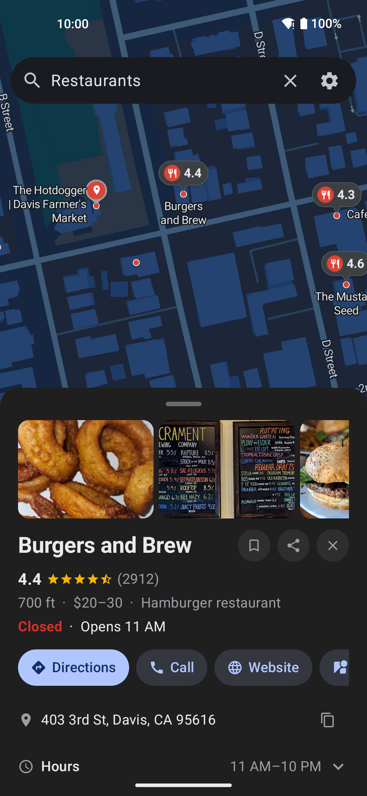
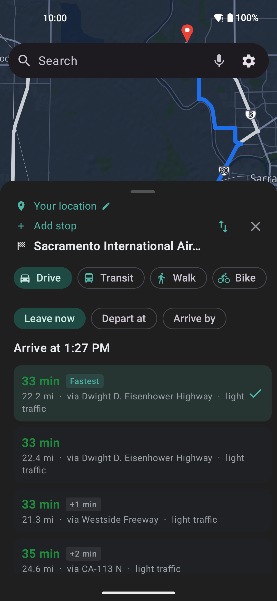
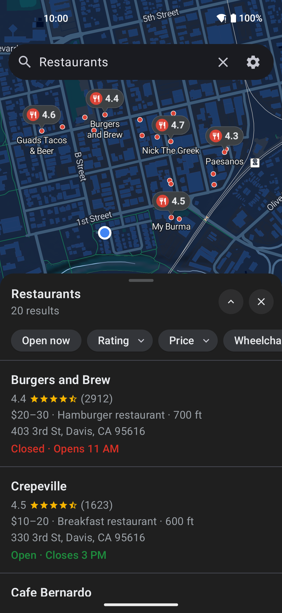
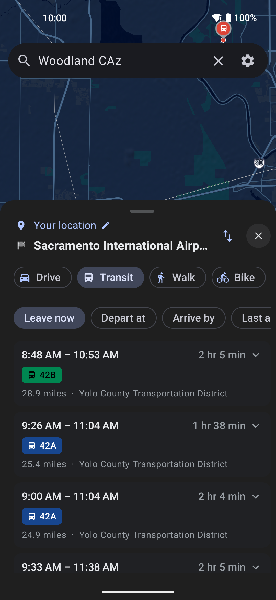
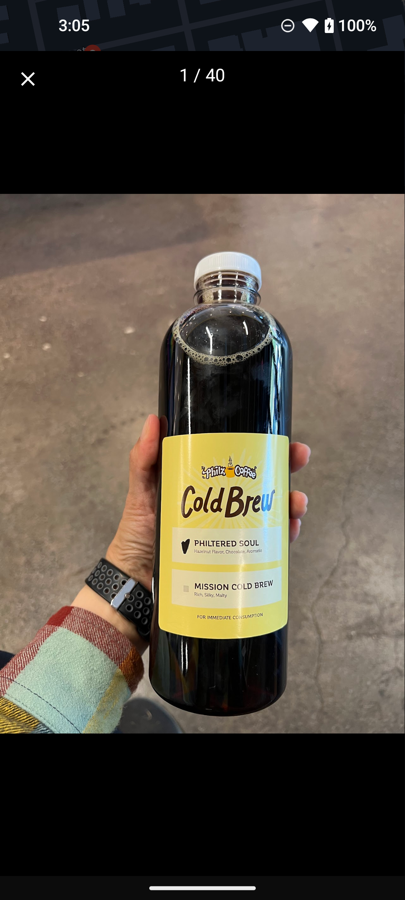
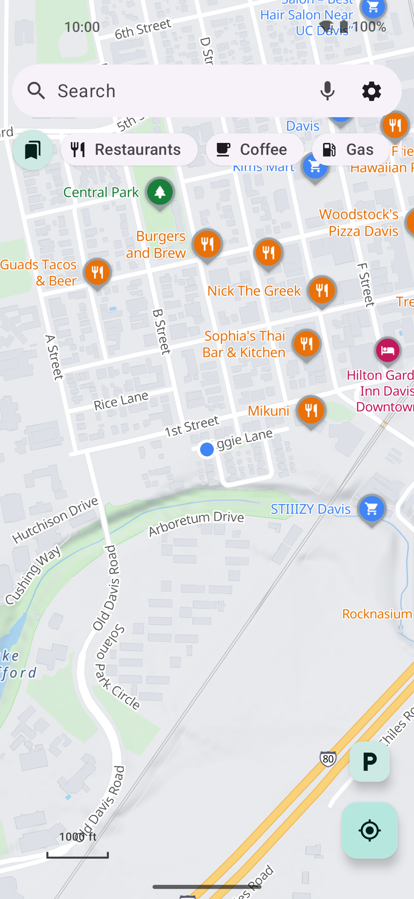
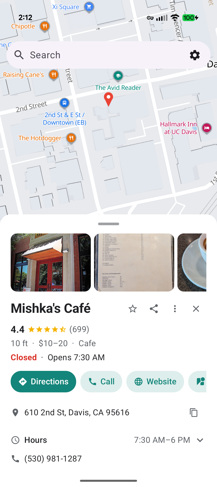

# Vela Maps

A degoogled maps & navigation client for Android - *what NewPipe is to YouTube,
for Google Maps.* Open vector tiles for the basemap, the device itself scraping
Google's public web endpoints (per-user, no backend) for the things only Google
does well: POI quality, routing, and **traffic-aware ETAs**. Built to run on
GrapheneOS and other no-GMS ROMs.

## Screenshots

| Navigation | Map & search | Place details | Directions | Search results |
|:-:|:-:|:-:|:-:|:-:|
|  |  |  |  |  |

| Public transit | Photo gallery | Light theme - map | Light theme - place |
|:-:|:-:|:-:|:-:|
|  |  |  |  |

*Turn-by-turn with the maneuver banner, exit badges and speedometer; the keyless
OpenFreeMap basemap with Google-style POI markers; live place data with the full
photo gallery; the directions panel with alternates and traffic in plain words;
and the in-app light/dark themes (decoupled from the OS).*

## Install

[](https://apps.obtainium.imranr.dev/redirect?r=obtainium://add/https://github.com/PimpinPumpkin/Vela)&nbsp;&nbsp;[](FDROID.md)

Tap a badge - no Play Store, no account. Obtainium auto-tracks the
**weekly stable** release; turn on "include prereleases" and you get the
**nightly** channel instead (every push to main). The F-Droid badge is
**Vela's own repository**, not the f-droid.org catalog - it works in any
F-Droid client and serves the same signed APKs. Or grab an APK straight from
[Releases](https://github.com/PimpinPumpkin/Vela/releases).

**F-Droid setup:** add the repo to your client and install/update from there.
It follows the weekly stable by default; nightlies are there too if you enable
unstable updates for Vela in your client (details in [FDROID.md](FDROID.md)):

```
https://pimpinpumpkin.github.io/Vela/repo
```

Fingerprint and full instructions in [FDROID.md](FDROID.md).

---


## What you get

- **Real turn-by-turn navigation.** Spoken directions from a neural voice that runs
  entirely on your phone, lane diagrams, exit shields, a speedometer, automatic
  reroutes, and a heads-up (on a card and out loud) when your destination closes
  within an hour of your arrival.

  🔊 **Hear Vela's nav voice** - the actual in-app voice at the default
  pace:

  https://github.com/user-attachments/assets/17f246e4-51c8-4d01-998b-dcd7f29dc15f

- **Fixes itself when Google moves things.** The scraping recipes live in a signed
  config the app checks at launch - when Google shifts a field or an endpoint, a
  repair ships to every install in minutes, no update needed. The same channel can
  push a heads-up notice ("search is down, fix coming") straight onto the map.

- **Talk to it.** Tap the mic and say what you want. Vela Voice transcribes speech
  on the phone (a one-time 58 MB download), or hands off to a voice-input app you
  already have. Either way, nothing you say goes to a cloud speech service.
- **Works offline.** Download a state or country once and its maps, turn-by-turn
  routing, and every place in it stay searchable with no signal - typed street
  addresses included.
- **Real place info.** Hours (holidays included), reviews you can search, photo
  galleries, busy times, phone and website - the things you actually check before
  driving somewhere, with a warning if it would be closed when you arrive.
- **Traffic you can read.** Route choices say light, moderate or heavy traffic in
  words next to their green/amber/red times, and the fastest route leads the list.
- **Public transit.** Itineraries with line pills, station-by-station stops, and
  step-by-step guidance to the platform.
- **No account, no tracking.** No Google account, no GMS, no telemetry. What
  Google's servers can and cannot see is documented plainly in [PRIVACY.md](PRIVACY.md).
- **The rest.** Android Auto, 11 languages, in-app light/dark, full D-pad operation
  for keypad phones, parking memory, place lists, and a built-in updater with
  weekly-stable or nightly channels.

The complete running feature list lives in [FEATURES.md](FEATURES.md).

## Everyday features in ten seconds

- **Save your parking**: tap the **P** button on the map when you park. Tap the teal
  pin later for walking directions back, or the pin's Clear button when you leave.
  Long-press **P** for your parking history in case you overwrote a spot by mistake.
- **Lists**: the bookmark button next to the category chips opens **Your lists**.
  Create one there, or add any place from its page (⋮ → Save to list), with a note
  per place. Lists back up to a file from Settings.
- **Import a Google Maps list**: paste a `maps.app.goo.gl` share link into the
  search bar. The list's places show up as results with the owner's notes; tap
  **Save list** to keep a local copy.
- **Nightly builds**: Settings → Version → "Include nightly builds" updates you to
  the newest build instead of weekly stable.

## Why a degoogled app uses Google

A phone without Google Play Services cannot run Google Maps, and the open map
datasets fall well short on search, reviews, hours, and live traffic. So Vela is
a thin client over Google's public web endpoints. It asks them the same way a
logged-out browser does, once per user, with no account, no shared API key, and
no server in the middle. NewPipe does the same for YouTube. There are no ads, and
your searches, saved places, and history stay on the phone. If you run GrapheneOS
or another no-GMS ROM, this gets you working maps back.

The map itself, the streets, the labels, and the house numbers all come from OpenStreetMap. Google is only used for places, search, routing, and traffic. So street names and house numbers can differ from what Google Maps shows, and how much detail you see offline depends on how well OpenStreetMap covers your area. I'm thinking of ways to improve OSM and fill the gaps in the data. Stay tuned.

> Status: **a genuinely usable day-to-day maps app.** Calibrated against live
> captures and verified end-to-end on-device:
>
> - **Search & places** - real POIs with name, rating, **reviews**, full address,
>   category, price, website, weekly hours, distance, a **full photo gallery**,
>   **popular times**, and **"people also search for"**; **Home/Work shortcuts**,
>   saved places, and **deep links** (Vela opens `geo:`/Google-Maps links and
>   shares a place as a keyless `geo:` pin).
> - **Routing** - drive / walk / bike / **public transit**. Turn-by-turn comes from
>   the **open OSRM** router (complete street-named steps, incl. highway refs / exit
>   numbers / shields); **Google is overlaid for the live-traffic ETA and to reroute
>   around jams** (it re-runs OSRM through Google's jam-avoiding path only when they
>   diverge). Selectable **alternates**, **reverse-trip swap**, **live-traffic overlay**,
>   **search-along-route**, and depart/arrive-time planning.
> - **Offline routing** - full turn-by-turn **on the phone** via an embedded
>   **GraphHopper** engine, from a downloadable **135-region world catalog** (all US
>   states, Canada, Europe, + more) hosted as GitHub release assets. Saving offline
>   map tiles for an area grabs its routing graph too.
> - **Navigation** - turn-by-turn with a Google-style maneuver banner: a **real
>   per-lane diagram** (which lane to be in), **highway/exit shields**,
>   swipe-to-look-ahead, spoken + haptic guidance, a **speedometer**, a
>   **posted speed-limit sign** (OSM `maxspeed`, keyless + offline, reddens when
>   speeding), pan-away **re-center**, faster-route re-checks, and an arrival summary.
> - **Polish** - in-app light/dark, one consistent Google-grey UI, custom POI
>   markers, hillshade relief, a **map scale bar**, and **offline** basemap + POI
>   download.
>
> Every push to `main` publishes a signed nightly prerelease; a weekly job promotes
> the newest nightly to the stable release Obtainium tracks by default.
> `MockMapDataSource` stays as an offline fallback; both build types are green.
>
> See **[`SPEC.md`](SPEC.md)** for the full architecture / extractor contract /
> resilience-layer specification (the rebuild target), and **[`ROADMAP.md`](ROADMAP.md)**
> for what's planned (opt-in telemetry, a Vela-own traffic layer, predictive depart-time ETA, …).

## Privacy

There is **no Vela backend, no account, and no telemetry**. Vela fetches from Google
directly from your phone like a logged-out browser - Google sees your IP, query, and
map area, but **not a Google account or any app key**, much like using
`google.com/maps` in an incognito window. Your saved places, history, and settings
never leave the device. **[Read the full breakdown of exactly what each service
receives → `PRIVACY.md`](PRIVACY.md).**

## Why it's built this way

Two decisions from the planning phase shape everything:

1. **No Vela backend.** Like NewPipe, every install talks to Google directly
   from the user's own IP, behaving like a single browser. There is no shared
   API key and no server farm to run, scrape from, or get subpoenaed. The cost
   is a maintenance lifestyle: Google rotates these endpoints, so the extractor
   will periodically need re-calibration and an app update.
2. **Open tiles, scraped intelligence.** The *basemap* is open vector tiles
   (Protomaps/MapLibre), so the heaviest per-user load never touches Google and
   we control the cartography. We only scrape Google for POIs, routing, and the
   traffic that's baked into its directions responses - the parts where Google
   genuinely has unique data.

## How it works - each capability and the method behind it

The one-screen map of *what Vela does* and *how*, with the entry point to read next. Deeper detail is in [`SPEC.md`](SPEC.md); this is the index into it.

| Capability | Method (how) | Start here |
|---|---|---|
| **Basemap** | Open vector tiles (OpenFreeMap / Protomaps) via MapLibre - keyless, no Google | `core/data/tiles/`, `app/ui/map/VelaMapView.kt` |
| **Search, places, reviews, hours** | Per-user keyless scrape of `google.com` `pb` endpoints (browser-like session token); responses are positional arrays walked by calibrated index paths | `core/data/google/`, SPEC §3 |
| **Photo gallery** | Hidden **anonymous WebView** same-origin-fetches the gallery RPC (OkHttp gets a bot-degraded reply) | `app/web/WebPhotoFetcher.kt` |
| **Public transit** | Hidden WebView reads the directions SPA's `APP_INITIALIZATION_STATE` | `app/web/WebDirectionsFetcher.kt`, `core/…/TransitParser` |
| **Turn-by-turn routing** | **FOSSGIS OSRM** (open) - complete street-named steps incl. highway `ref`/exit/lanes; retried on blips | `core/data/RouteGeometry.kt` |
| **Traffic ETA + jam reroute** | Google's directions overlaid on the OSRM route; re-runs OSRM through Google's path only when they diverge (option 3) | `GoogleMapsDataSource.directions`/`applyTraffic` |
| **Offline routing** | On-device **GraphHopper** CH graphs, one per region, downloaded from a 135-region world catalog | `core/data/GraphHopperRouteEngine.kt`, `app/offline/RoutingGraphStore.kt`, `tools/routing-regions.json` |
| **Offline address geocoding** | Typed street address → coordinate → GraphHopper route with no signal; keyless OSM `addr:housenumber` + named-road centrelines indexed on area download (house-precise, interpolated, or street-level fallback) | `core/data/OfflineAddressStore.kt`, `core/data/OverpassPois.kt` |
| **Offline place packs** | Downloading a state also pulls its whole-region place pack (CI-baked SQLite of every OSM POI/address/street), so offline search covers the entire state, Organic-Maps-style. Packs rebuild monthly from fresh OSM; installed ones update in place with small row-level deltas | `app/offline/PoiPackStore.kt`, `core/data/OfflinePacks.kt`, `scripts/build-poi-region.sh`, `scripts/poipack_delta.py`, `.github/workflows/poi-packs.yml` |
| **Open building overlay** | Microsoft building footprints (ODbL) as per-region PMTiles, rendered beneath OSM to fill areas OSM never mapped; world catalog of 51 US states + ~185 countries (US + Global ML sources) | `app/offline/OverlayTileStore.kt`, `app/ui/map/VelaMapView.kt`, `scripts/build-overlay-region.sh`, `tools/overlay-regions.json` |
| **Open house-number overlay** | OpenAddresses address points as per-state PMTiles, streamed + rendered as a house-number SymbolLayer where OSM lacks `addr:housenumber` | `app/ui/map/VelaMapView.kt`, `scripts/build-address-region.sh`, `tools/address-regions.json` |
| **Navigation (banner, voice, haptics)** | Pure `NavEngine` turn logic (unit-tested) → maneuver banner (lane diagram / shields), AOSP TTS, direction-coded vibration | `core/nav/`, `app/ui/nav/`, `core/voice/`, `core/feedback/` |
| **Android Auto (full nav)** | Navigation-category CarAppService with car-side search, route preview with live-traffic alternates, and active turn-by-turn (turn card, "then" step, lane diagram, cluster support). The map renders through MapLibre's MapSnapshotter with route map-matching and smoothed puck motion. Sideloads show up with AA's "Unknown sources" on | `app/car/` (`VelaCarAppService.kt`, `CarMapRenderer.kt`, `screen/`) |
| **Location & heading** | AOSP `LocationManager` + raw rotation-vector sensor - never GMS/Fused | `core/location/` |
| **D-pad-only operation** | The whole UI works with a 5-key D-pad, no touchscreen (touch is a bonus): key-drivable map (arrows pan, OK-at-crosshair taps, hold-OK drops a pin, on-screen zoom buttons), focus rings, key alternatives for every gesture | [`docs/dpad.md`](docs/dpad.md), `app/ui/DpadFocus.kt`, `app/ui/map/MapDpadController.kt` |
| **Lists & Google Maps list import** | Local place lists (icon + colour, notes per place, export/import to a file); pasting a Google Maps share link previews the list's places with a one-tap Save | `core/data/PlaceListStore.kt`, `core/data/google/parse/EntityListParser.kt` |
| **Parking spot memory** | One tap on the P button saves where you parked (teal pin, walking directions back); long-press for the history so an accidental overwrite never loses the car | `core/data/ParkingStore.kt` |
| **Fix drift without an app update** | ECDSA-signed remote `calibration.json` (pb templates, field-index paths, JS transforms) + notices, verified against a pinned key | `core/config/CalibrationStore.kt`, SPEC §5 |
| **Distribution** | Code push to `main` → signed nightly prerelease (docs-only changes don't cut releases); weekly promote to stable (same APK); Obtainium tracks stable by default, nightlies via the prerelease toggle; a self-hosted F-Droid repo serves both channels ([FDROID.md](FDROID.md)) | `.github/workflows/ci.yml` + `promote-stable.yml` + `fdroid-repo.yml` |

## Docs - where to look

| File | What's in it |
|---|---|
| [`README.md`](README.md) | This - what Vela is, why, the how-it-works map above, and build/run |
| [`FEATURES.md`](FEATURES.md) | The full, categorised list of every shipped capability (the encyclopaedia) |
| [`SPEC.md`](SPEC.md) | The authoritative **rebuild spec** - architecture, extractor contract (pb layouts + response indices), resilience layer, hard constraints |
| [`ROADMAP.md`](ROADMAP.md) | Planned work + big bets (opt-in telemetry, a Vela-own traffic layer, giant-country graph splits, …) |
| [`PRIVACY.md`](PRIVACY.md) | Exactly what each Google endpoint receives, per request |
| [`CLAUDE.md`](CLAUDE.md) | Build rules, module layout, and the hard-won gotchas - for contributors (human or AI) |
| [`docs/dpad.md`](docs/dpad.md) | D-pad / no-touchscreen operation - design, findings, per-surface audit, and the merge-with-upstream policy |
| [`docs/CALIBRATION.md`](docs/CALIBRATION.md) | The Google extractor + the signed remote-repair channel, in depth |
| [`docs/MAP-STYLE.md`](docs/MAP-STYLE.md) | Basemap, fonts, custom layers and theming details |

## Architecture

Two Gradle modules (AGP 8.7.3, Kotlin 2.1, Compose, Hilt, version catalog,
R8 release builds):

```
:core   the "extractor" - no UI dependency, the NewPipeExtractor pattern
        ├─ model/            LatLng, Place, Route, Maneuver … (pure Kotlin)
        ├─ data/
        │   ├─ MapDataSource         the one seam every screen talks to
        │   ├─ MockMapDataSource     canned data → the app runs with no network
        │   ├─ google/               the real scraper
        │   │   ├─ GoogleSession         per-user bootstrap (token extraction)
        │   │   ├─ GoogleMapsDataSource  search / directions / place details
        │   │   ├─ PbBuilder             builds Google's `pb` URL protobuf
        │   │   ├─ GoogleResponse        XSSI strip + positional-array navigator
        │   │   ├─ PolylineCodec          encoded-polyline decode (calibration-free)
        │   │   └─ parse/                 Search / Directions / Transit / Photos / Reviews
        │   ├─ RouteGeometry             OSRM turn-by-turn (open router) + parse of steps/lanes/refs
        │   ├─ RouteEngine               offline-routing interface (connectivity/graph-presence picks it)
        │   ├─ GraphHopperRouteEngine    on-device GraphHopper CH graphs, one per downloaded region
        │   ├─ RouteCorridor             "search along route" - filter results to the line
        │   ├─ OverpassPois              keyless OSM POI + addr + street fetch (offline-search/geocode source)
        │   ├─ OfflinePoiStore           on-device SQLite POI index (offline search)
        │   ├─ OfflineAddressStore       on-device SQLite forward geocoder (typed address → coord, offline)
        │   ├─ OfflinePacks              registry of downloaded whole-region place packs (both stores query them)
        │   └─ tiles/                MapStyle catalog (OpenFreeMap default / Positron / Protomaps)
        ├─ location/         LocationProvider - AOSP LocationManager (no Fused)
        ├─ voice/            VoiceGuide - AOSP TextToSpeech, engine-selectable
        ├─ feedback/         Haptics - direction-coded vibration turn cues
        ├─ config/           Calibration + CalibrationStore (remote pb/paths)
        ├─ nav/              NavEngine - pure turn-by-turn logic + NavReplay auditor (unit-tested)
        ├─ replay/           TripLog - trip CSV format + offline route audit
        └─ di/               Hilt wiring; picks Mock vs Google off VelaConfig

:app    Jetpack Compose UI (Material 3)
        ├─ MainActivity, VelaApp
        ├─ ui/map/           MapScreen, VelaMapView (MapLibre), MapViewModel, PoiIcons
        ├─ ui/search/        SearchBar
        ├─ ui/place/         PlaceSheet, DirectionsPanel, transit board, photo gallery
        ├─ ui/nav/           ManeuverBanner (lanes/shields/swipe), NavControls, StepsSheet
        ├─ ui/theme/         AppTheme - in-app light/dark, decoupled from the OS
        ├─ ui/               SheetPalette (one shared sheet palette), Format, Units
        ├─ web/              WebPhotoFetcher, WebDirectionsFetcher - hidden-WebView scrapes
        ├─ offline/          OfflineMaps (MapLibre tiles) + RoutingGraphStore (GraphHopper graphs) + PoiPackStore (place packs) + OverlayTileStore (building-footprint PMTiles)
        └─ ui/settings/      SettingsScreen (appearance / style / voice / haptics / keep-screen-on / offline)
```

The `MapDataSource` interface is the load-bearing seam: Mock today, Google once
calibrated, and a future Overture/OSM source or self-hostable backend (the
"Piped for Vela" idea) drops in the same way.

## Build & run

Standard Android toolchain:

```bash
# debug build (compile check / local install)
./gradlew :app:assembleDebug

# the real distribution build - R8 + resource shrinking.
# Always ship release: debug builds visibly lag during map scroll/nav.
./gradlew :app:assembleRelease

# unit tests for the pure logic (polyline codec, nav engine)
./gradlew :core:test
```

Release signing comes from CI env vars (`VELA_KEYSTORE_PATH`,
`VELA_KEYSTORE_PASSWORD`, `VELA_KEY_ALIAS`); local builds fall back to the
debug keystore so `adb install` still works.

**CI** (`.github/workflows/`): every push to `main` builds + tests the APK,
uploads it as an artifact, and publishes a **normal versioned release**
(`v0.3.<run>`, versionCode `2000+run`) - nightlies as prereleases, the weekly
promoted stable as the normal release, so Obtainium
tracks the latest with zero configuration and no pre-release toggle. The release APK is signed with the keystore from repo secrets
`VELA_KEYSTORE_BASE64`, `VELA_KEYSTORE_PASSWORD`, `VELA_KEY_ALIAS` (without them
it's debug-signed - installable, but not update-compatible across builds). An
optional `MAPTILER_KEY` secret is injected into `BuildConfig` (`-PmaptilerKey`)
to switch the basemap to MapTiler; it's never committed, and the app falls back
to keyless OpenFreeMap without it. The repo is public, so release assets (e.g.
for Obtainium) download with no token; workflow artifacts still need you signed
in to GitHub.

Out of the box the app talks to the live Google source over the keyless
OpenFreeMap basemap; `MockMapDataSource` is the offline fallback.

## The Google extractor & calibration

The full write-up moved to [`docs/CALIBRATION.md`](docs/CALIBRATION.md): the per-user
extractor, the signed remote-repair channel, and the recalibration playbook.

## Degoogled / GrapheneOS notes

- **Location:** AOSP `LocationManager` (GPS + NETWORK simultaneously), never
  `FusedLocationProviderClient`. We cache last-known to seed an instant map and
  show a one-time PSDS tip when the cold fix is slow - on GrapheneOS, enabling
  PSDS (Settings → Location) drops TTFF from ~30s to a few seconds.
- **Voice:** a built-in **neural voice** that runs entirely on-device - Vela bundles the sherpa-onnx
  runtime and downloads a Piper model itself (progress bar), no standalone app. A **Voice library**
  (Settings → Voice) lets you browse, download and switch between ~40 Piper voices (Lessac, HFC, Ryan,
  the HFC Female default, British voices, …) to find the read you like. Plus AOSP
  `TextToSpeech`: we enumerate the phone's installed engines so you can override to any system voice.
  Spoken directions have an on/off switch that the in-nav mute button shares. **Voice search** is
  on-device too: the search-bar mic records and transcribes with Vela's own downloadable Whisper
  model (same bundled runtime, mic permission asked at first use), or hands off to a voice-input
  app you already have; with neither installed the mic offers the download.
- **No GMS anywhere:** no Fused location, no FCM, no Firebase, no Play Integrity.
  Everything (MapLibre, OkHttp, Compose, Hilt) is pure AOSP. OrganicMaps is the
  existence proof; Vela's stack is a superset.

## Map style

Details moved to [`docs/MAP-STYLE.md`](docs/MAP-STYLE.md).

## Roadmap

Everything shipped so far is in [FEATURES.md](FEATURES.md) (the complete list) and the
release notes of each build. Still open (details in [ROADMAP.md](ROADMAP.md)):

- [ ] Avoid tolls / avoid highways (the open router already supports it per request)
- [ ] Restaurant menu reliability (Google tags menu photos inconsistently; digging in)
- [ ] Satellite imagery layer (open Esri World Imagery)
- [ ] **Predictive** (future-traffic) depart-time ETA - needs a directions-`pb` calibration
- [ ] Optional offline highway refs
- [ ] Embedded Mapillary/KartaView street imagery (needs a token; Street View currently opens Google's keyless pano in the browser)
- [ ] F-Droid submission + reproducible build

**Not going to happen** - anything that needs you to sign in to Google or hand data to a
backend: contributing reviews/photos/edits, live location sharing and share-ETA, a location
timeline, and the login-gated data Google strips from anonymous requests (live busyness).
Vela's whole point is that no account and no server ever sees you.


## A note on the name

**Vela Maps** (`app.vela`) - the navigator's constellation "the Sails", and
"sail" in several languages. The name was vetted clear of maps-app and
trademark collisions.

## Contributing

Read [`CONTRIBUTING.md`](CONTRIBUTING.md) first - it covers the hard rules (no
backend, no static Google keys, degoogled runtime, the `:core`/`:app` module
boundary, docs-in-the-same-commit, and translations for all 11 locales) and how to
send a change. There is no separate code-of-conduct document by design: keep it
about the code. Security issues go through [`SECURITY.md`](SECURITY.md) (GitHub
private vulnerability reporting), not a public issue.

## License

GPLv3 - copyleft, matching the NewPipe ethos.
